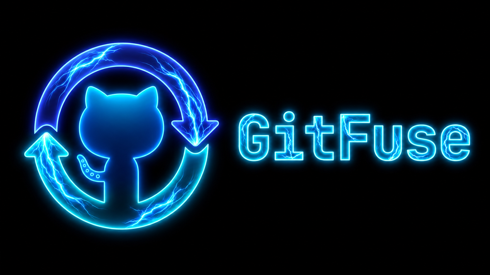

<p align="center">
  
</p>

# GitFuse ⚡

<p align="center">
  <strong>Carry committed Git work across your machines — without pushing WIP branches.</strong>
</p>

<p align="center">
  <a href="https://gitfuse.dev">Website</a>
  &nbsp;·&nbsp;
  <a href="https://gitfuse.dev/docs">Documentation</a>
  &nbsp;·&nbsp;
  <a href="https://github.com/VectorSolus/GitFuse/releases/tag/v0.1.1">Releases</a>
  &nbsp;·&nbsp;
  <a href="https://github.com/VectorSolus/GitFuse/issues">Issues</a>
</p>

<p align="center">
  <a href="https://gitfuse.dev/docs">
    
  </a>
  <a href="https://github.com/VectorSolus/GitFuse/releases/tag/v0.1.1">
    
  </a>
  <a href="LICENSE">
    
  </a>
  <a href="https://github.com/VectorSolus">
    
  </a>
</p>

<p align="center">
  
  
  
  
  
</p>

---

**GitFuse is a CLI and dashboard for moving committed Git work between trusted devices through a private relay.**

Commit on your laptop, run `gitfuse sync`, and continue from the same committed history on another machine with `gitfuse pull` — without creating a temporary remote branch just to move work around.

<table>
<tr>
<td width="33%" valign="top">

### ⚡ CLI first

Stay inside the Git workflow you already use.

```text
commit → sync → pull
```

</td>
<td width="33%" valign="top">

### 🔒 Private workflow

Move committed work without publishing unfinished branches to your Git remote.

</td>
<td width="33%" valign="top">

### 🖥 Trusted devices

Connect, inspect, and revoke machines from your GitFuse workspace.

</td>
</tr>

<tr>
<td width="33%" valign="top">

### 📦 Git-native

GitFuse works with committed Git objects rather than copying arbitrary folders.

</td>
<td width="33%" valign="top">

### ↩ Recovery tools

Restore repositories, reconnect machines, inspect history, and recover transferred work.

</td>
<td width="33%" valign="top">

### 📊 Dashboard

See repositories, devices, history, usage, account settings, and plans in one place.

</td>
</tr>
</table>

---

## Quick Install

### Linux / macOS

```bash
curl -fsSL https://gitfuse.dev/install.sh | sh
```

### Homebrew

```bash
brew tap VectorSolus/gitfuse https://github.com/VectorSolus/GitFuse.git
brew install VectorSolus/gitfuse/gitfuse
```

### Windows

```powershell
winget install gitfuse
```

Or install using the exact package ID:

```powershell
winget install --id GitFuse.GitFuse -e
```

### Manual binaries

Pre-built binaries and checksums are available from:

**[GitFuse v0.1.1 → GitHub Releases](https://github.com/VectorSolus/GitFuse/releases/tag/v0.1.1)**

---

## Getting Started

### 1. Authenticate your machine

```bash
gitfuse auth login
```

For a headless environment:

```bash
gitfuse auth login --headless
```

### 2. Add a repository

```bash
cd your-project
gitfuse add .
```

### 3. Sync committed work

```bash
gitfuse sync
```

### 4. Continue on another machine

```bash
gitfuse auth login
gitfuse pull
```


📖 **[Read the full documentation →](https://gitfuse.dev/docs)**

---

## Why GitFuse?

A normal Git workflow becomes awkward when the code is committed but **not ready to publish**.

Without GitFuse, switching machines often means:

```text
local commit
     ↓
create temporary WIP branch
     ↓
push it
     ↓
pull it elsewhere
     ↓
clean up the temporary branch later
```

With GitFuse:

```text
local commit
     ↓
gitfuse sync
     ↓
gitfuse pull elsewhere
```

### GitFuse vs. common workarounds

| | GitFuse | WIP branch | Manual copy | Cloud folder |
|---|:---:|:---:|:---:|:---:|
| Keeps unfinished work off your Git remote | ✅ | ❌ | ✅ | ✅ |
| Preserves Git commit history | ✅ | ✅ | ❌ | ❌ |
| CLI-native workflow | ✅ | ⚠️ | ❌ | ❌ |
| No temporary branch cleanup | ✅ | ❌ | ✅ | ✅ |
| Designed for multiple trusted devices | ✅ | ⚠️ | ❌ | ⚠️ |
| Repository-aware | ✅ | ✅ | ❌ | ❌ |

> GitFuse does not replace GitHub, GitLab, or another Git remote.  
> It fills the gap **before your work is ready to publish**.

---

## How It Works

```text
       Device A                     GitFuse Relay                     Device B
       ────────                     ─────────────                     ────────

     git commit
         │
         ▼
   gitfuse sync  ───────────────▶  committed bundle  ─────────────▶  gitfuse pull
                                                                          │
                                                                          ▼
                                                                  continue working
```

GitFuse is focused on **committed Git work**.

### GitFuse moves

- committed Git objects
- repository sync state
- commit history required for the sync workflow

### GitFuse does not move

- uncommitted working-tree changes
- untracked files
- ignored files
- stashes
- editor state
- arbitrary filesystem contents

> **If it is not committed to Git, GitFuse does not sync it.**

---

## CLI Reference

### Common commands

| Action | Command |
|---|---|
| Sign in | `gitfuse auth login` |
| Headless sign in | `gitfuse auth login --headless` |
| Show identity | `gitfuse auth whoami` |
| Add current repository | `gitfuse add .` |
| List repositories | `gitfuse repo list` |
| Sync | `gitfuse sync` |
| Preview sync | `gitfuse sync --dry-run` |
| Select commits | `gitfuse sync --pick` |
| Pull | `gitfuse pull` |
| Pull to a branch | `gitfuse pull --as-branch <branch>` |
| Show status | `gitfuse status` |
| Show history | `gitfuse history` |
| List devices | `gitfuse devices` |
| Restore | `gitfuse restore <relay-entry-name>` |
| Diagnostics | `gitfuse doctor` |
| Version | `gitfuse version` |
| Update | `gitfuse update` |

<details>
<summary><strong>View full CLI reference</strong></summary>

<br>

### Authentication

```bash
gitfuse auth login
gitfuse auth login --headless
gitfuse auth whoami
gitfuse auth logout
```

### Repositories

```bash
gitfuse add .
gitfuse repo list
gitfuse repo remove <repo>
gitfuse repos
gitfuse use <name>
```

### Sync

```bash
gitfuse sync
gitfuse sync --dry-run
gitfuse sync --pick
gitfuse sync --all
gitfuse rebase-sync
```

### Pull

```bash
gitfuse pull
gitfuse pull --as-branch <branch>
```

### Status & History

```bash
gitfuse status
gitfuse status --all
gitfuse history
gitfuse log
```

### Devices

```bash
gitfuse devices
gitfuse devices revoke <id>
```

### Auto Sync

```bash
gitfuse autosync status
gitfuse autosync enable
gitfuse autosync enable --delay 5s
gitfuse autosync disable
```

### Recovery

```bash
gitfuse restore <relay-entry-name>
gitfuse claim
gitfuse connect
gitfuse undo
gitfuse drop
gitfuse doctor
```

### Account & Utilities

```bash
gitfuse limits
gitfuse config-dir
gitfuse version
gitfuse update
```

</details>

---

## Dashboard

The GitFuse dashboard at **[gitfuse.dev](https://gitfuse.dev)** gives you a visual workspace alongside the CLI.

<table>
<tr>
<td><b>📁 Repositories</b></td>
<td>View repositories currently connected to your workspace.</td>
</tr>

<tr>
<td><b>🖥 Devices</b></td>
<td>Review and manage trusted machines.</td>
</tr>

<tr>
<td><b>↻ History</b></td>
<td>Inspect recent GitFuse sync activity.</td>
</tr>

<tr>
<td><b>📊 Usage</b></td>
<td>Track repository, device, storage, and history limits.</td>
</tr>

<tr>
<td><b>⚡ Upgrade plans</b></td>
<td>Compare your current Free plan with upcoming Pro and Team plans.</td>
</tr>
</table>

### Sign-in methods

<p>
  
  
  
</p>

---

## Plans

GitFuse is **free during launch**.

Pro and Team are coming soon with larger limits and additional workspace capabilities.

| Feature | Free | Pro | Team |
|---|:---:|:---:|:---:|
| Private repositories | **5** | Unlimited | Unlimited |
| Trusted devices | **2** | Unlimited | Unlimited |
| Relay storage | **500 MB** | 30 GB | 30 GB |
| Sync history | **7 days** | 365 days | 365 days |
| Private commit sync | ✅ | ✅ | ✅ |
| Priority workspace limits | — | ✅ | ✅ |
| Team workspace access | — | — | Coming soon |
| Shared repository controls | — | — | Coming soon |
| Managed device access | — | — | Coming soon |
| Repository-scoped API keys | Upcoming | Upcoming | Upcoming |

---

## Security

GitFuse is designed around explicit accounts, trusted devices, and committed Git history.

<table>
<tr>
<td><b>Account authentication</b></td>
<td>A valid GitFuse account is required before workspace access is granted.</td>
</tr>

<tr>
<td><b>Explicit device trust</b></td>
<td>Machines are registered independently and can be revoked from your account.</td>
</tr>

<tr>
<td><b>Controlled pairing</b></td>
<td>CLI device authorization requires an explicit account-side approval flow.</td>
</tr>

<tr>
<td><b>Committed content boundary</b></td>
<td>GitFuse does not sync arbitrary uncommitted filesystem contents.</td>
</tr>

<tr>
<td><b>Workspace visibility</b></td>
<td>Repositories, device state, usage, and sync history are visible from the dashboard.</td>
</tr>
</table>

GitFuse complements your existing Git remote and backup strategy rather than replacing either one.

---

## Documentation

Full documentation is available at:

**[gitfuse.dev/docs →](https://gitfuse.dev/docs)**

| Section | Covers |
|---|---|
| **Quick start** | Install → authenticate → add repository → sync |
| **Installation** | Public installation methods |
| **Authentication** | Browser and headless sign-in |
| **Repositories** | Add, list, select, and remove repositories |
| **Sync workflow** | Sync, pull, commit selection, rewritten history |
| **Status & history** | Local and relay sync state |
| **Devices** | Trusted-device management |
| **Auto sync** | Automatic sync controls |
| **Recovery** | Restore, claim, connect, undo, doctor |
| **Account & config** | Limits, version, updates, config |

---

## Built With

<p>
  
  
  
  
  
  
  
</p>

---

## Development

### Requirements

- Go 1.22+
- Node.js 20+
- pnpm
- PostgreSQL-compatible development database

Clone the repository:

```bash
git clone https://github.com/VectorSolus/GitFuse.git
cd GitFuse
pnpm install
```

Build the CLI:

```bash
go -C apps/cli build -o ../../bin/gitfuse .
./bin/gitfuse --help
```

Run tests:

```bash
go -C apps/cli test ./...
pnpm --filter @gitfuse/dashboard test
```

Run the dashboard:

```bash
pnpm --filter @gitfuse/dashboard dev
```

---

## Contributing

Contributions to the open-source GitFuse CLI are welcome.

For bugs and feature requests:

**[Open an issue →](https://github.com/VectorSolus/GitFuse/issues)**

---

## License

The GitFuse CLI is open source under the **[AGPL v3](LICENSE)**.

Hosted GitFuse infrastructure and managed services are operated separately.

---

<p align="center">
  <b>GitFuse ⚡</b> &#x25CF;
  Your committed Git work, everywhere.
  <br><br>
  <a href="https://gitfuse.dev">Website</a>
  &nbsp;·&nbsp;
  <a href="https://gitfuse.dev/docs">Docs</a>
  &nbsp;·&nbsp;
  <a href="https://github.com/VectorSolus/GitFuse/releases/tag/v0.1.1">Releases</a>
</p>